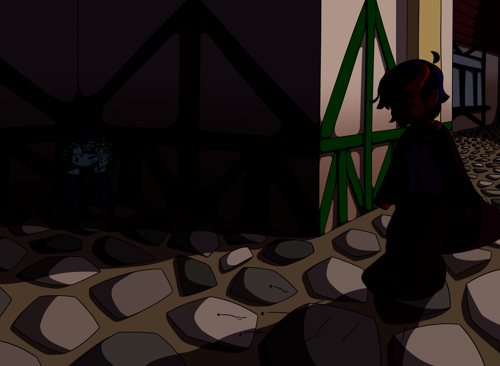
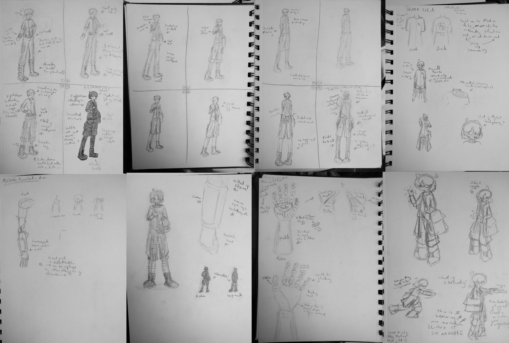
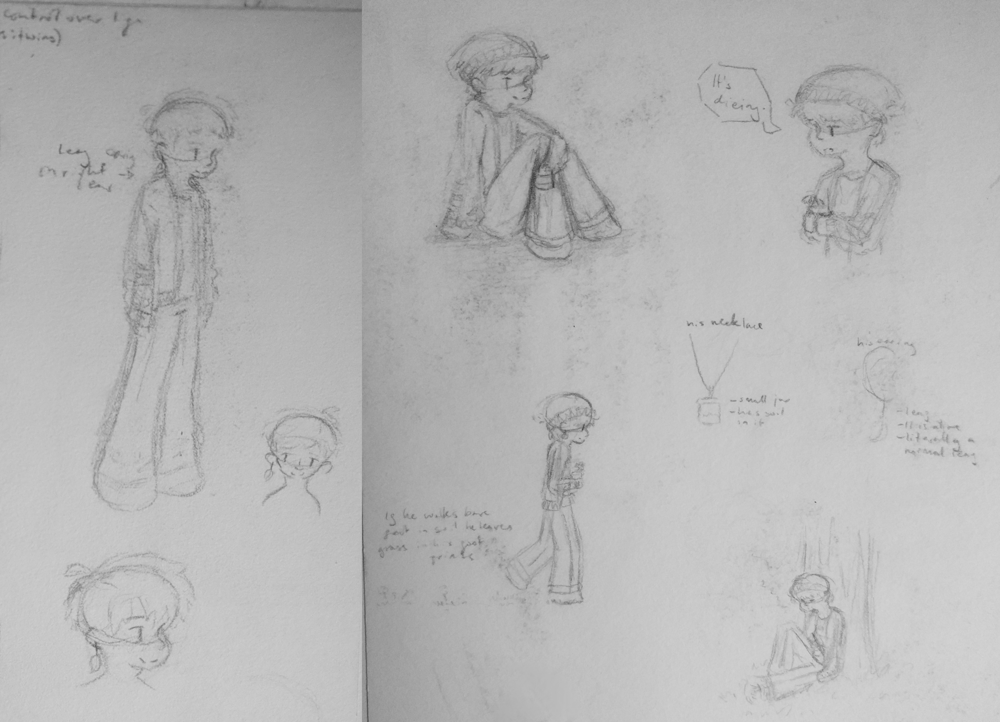
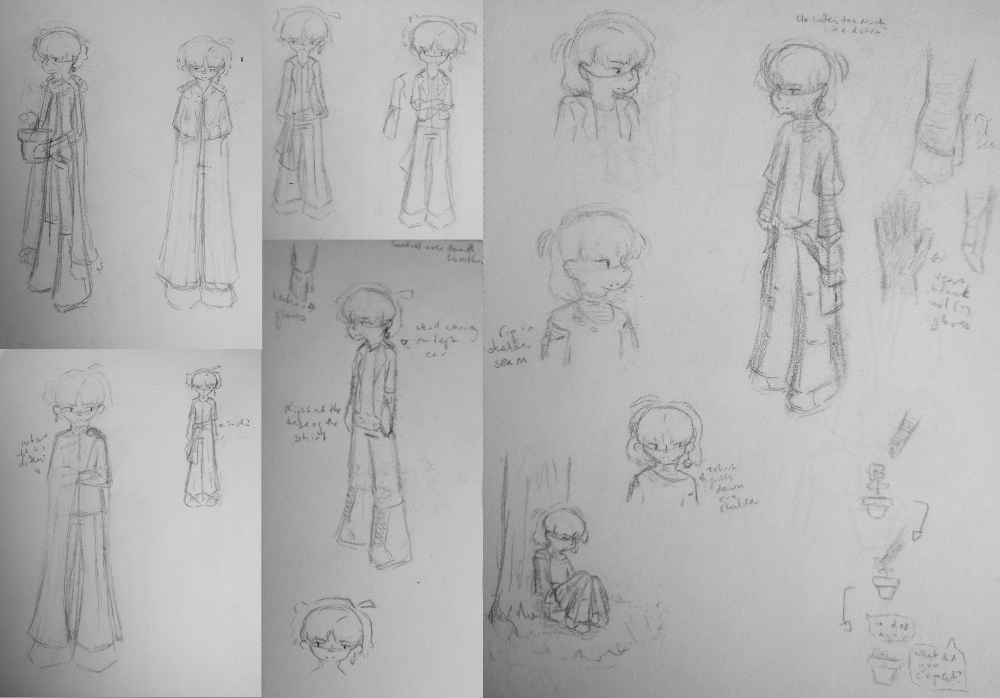
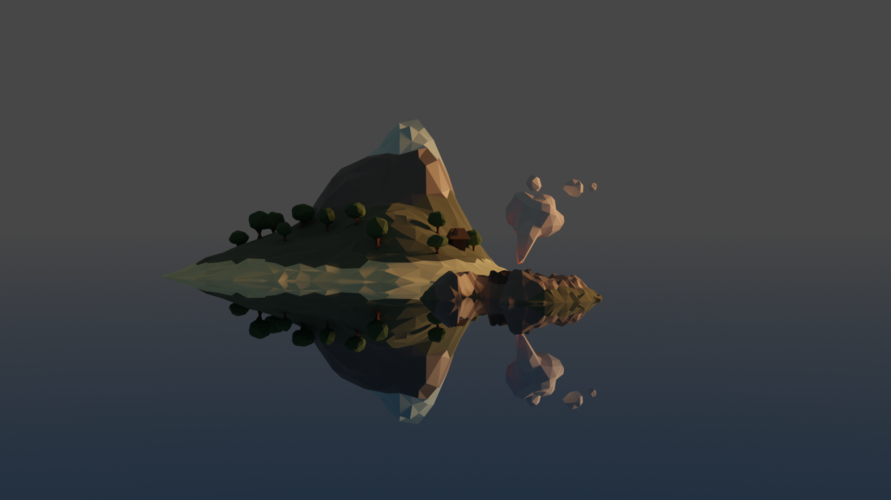
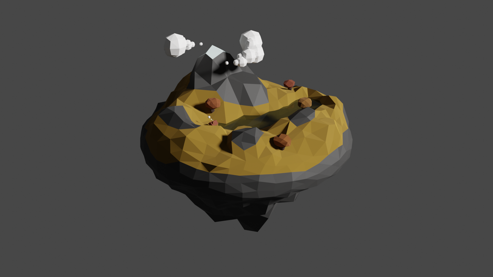

## D&D digital illustration

{ data-title="Five & Waltz meet for the first time." data-description="A digital illustration I made with Krita of a scene from the D&D game I play with my friend. The character on the right was designed by me, and the one on the left was designed by my friend." }

A digital illustration I made with Krita of a scene from the D&D game I play with my friend.
The character on the right was designed by me, and the one on the left was designed by my friend.

## '>>hello world.'

The game that I have been designing is called >>hello world. It is a 2D top-down game, and the core mechanic is the use of electricity and electromagnetism to manipulate the environment. 

### Astra

{ data-title="Astra character design process." data-description="The character design process for Astra, the player character in >>hello world. They are a robot, and the machinery of one of their arms is exposed, which means that they can attack using electricity." }
{ data-title="Astra walk cycle." data-description="A mock up of Astra's walk cycle, viewed from the front." }

<video width="640" height="360" controls>
  <source src="image/astrawalkfront_loop.mp4" type="video/mp4">
Your browser does not support the video tag.
</video>

Astra is the player character in >>hello world. They are a robot, and the machinery of one of their arms is exposed, which means that they can attack using electricity.

### Angel

{ data-title="Angel character design process." data-description="The character design process for Angel, the final boss in >>hello world. She was once a human but has now cybernetically enhanced her body and her mind so much that she is no longer human. She attacks the player using her tentacles and also electricity." }

Angel is the final boss in >>hello world. She was once a human but has now cybernetically enhanced her body and her mind so much that she is no longer human. She attacks the player using her tentacles and also electricity. She went through a lot of iterations, because I couldn't figure out what kind of boss I wanted her to be. However, I am very proud of her character design now.

### Ray

{ data-title="Ray character design process." data-description="Ray is an early boss in >>hello world. He attacks the player using Shockers, which is one of the minor enemies that the player fights, so the mechanics of the boss will not be entirely unfamiliar to the player." }

Ray is an early boss in >>hello world. He attacks the player using Shockers, which is one of the minor enemies that the player fights, so the mechanics of the boss will not be entirely unfamiliar to the player.

### Environment design of '>>hello world'

{ data-title="Environment design process." data-description="'>>hello world' is set in a city (called Crater City) that is underwater and under a dome. The bottom half of Crater City has no natural light and the top half does, but not much." }

'>>hello world' is set in a city (called Crater City) that is underwater and under a dome. The bottom half of Crater City has no natural light and the top half does, but not much.

### Unused final boss of '>>hello world.'

{ data-title="Unused boss fight design process." data-description="This is my sketches for the design of the old final boss of the game (that I ended up not using). It was an AI that controlled a robot body. The robot body was mostly made out of wires, and it would use these wires to attack the player during the boss fight." }

This is my sketches for the design of the old final boss of the game (that I ended up not using). It was an AI that controlled a robot body. The robot body was mostly made out of wires, and it would use these wires to attack the player during the boss fight.

## The Mortality Brothers

The Mortality Brothers are some characters that I made. they are twin brothers, and one of them has power over life, while the other has power over death. I wanted their designs to look like they are somewhat similar to each other, but also different.

### The Life Brother

### The Death Brother

## Rust

{ data-title="Rust character design (Art GCSE)" data-description="Rust is a character that I made as a part of my GCSE art course. They are a robot and a graffiti artist who lives underground in an abandoned train station. They are also a robot. I used Krita for the digital illustration on the right." }

Rust is a character that I made as a part of my GCSE art course. They are a robot and a graffiti artist who lives underground in an abandoned train station. They are also a robot. I used Krita for the digital illustration on the right.

## Eye animation

{ data-title="Eye animation (Art GCSE)" data-description="This is an eye animation that I made as a part of my GCSE art course (under the theme Similarities and Differences). I used an app on my phone and made illustrations on paper which I traced using a lightbox." }

<video width="640" height="360" controls>
  <source src="image/eye_art_exam.mp4" type="video/mp4">
Your browser does not support the video tag.
</video>

This is an eye animation that I made as a part of my GCSE art course (under the theme Similarities and Differences). I used an app on my phone and made illustrations on paper which I traced using a lightbox.

## 3D Models

### Islands

 <iframe title="islands" frameborder="0" allowfullscreen mozallowfullscreen="true" webkitallowfullscreen="true" allow="autoplay; fullscreen; xr-spatial-tracking" xr-spatial-tracking execution-while-out-of-viewport execution-while-not-rendered web-share width="640" height="480" src="https://sketchfab.com/models/3ba05836d32d4190a751b373b0ed15da/embed?autostart=1&camera=0"> </iframe> 
 <a href="https://sketchfab.com/3d-models/islands-3ba05836d32d4190a751b373b0ed15da?utm_medium=embed&utm_campaign=share-popup&utm_content=3ba05836d32d4190a751b373b0ed15da" target="_blank" style="font-weight: bold; color: #1CAAD9;"> islands </a> by <a href="https://sketchfab.com/elm.?utm_medium=embed&utm_campaign=share-popup&utm_content=3ba05836d32d4190a751b373b0ed15da" target="_blank" style="font-weight: bold; color: #1CAAD9;"> elm. </a> on <a href="https://sketchfab.com?utm_medium=embed&utm_campaign=share-popup&utm_content=3ba05836d32d4190a751b373b0ed15da" target="_blank" style="font-weight: bold; color: #1CAAD9;">Sketchfab</a>

{ data-title="Islands (3D model)" data-description=".islands-desc" }

A low poly 3D model I made in Blender of some islands in an ocean. One of the islands has a mountain and a house, and the other has a volcano. I used the Cycles render engine for the rendered images. 

To see the actual 3D model, click <a href="#islands">here</a> and close the gallery.

A low poly 3D model I made in Blender of some islands in an ocean. One of the islands has a mountain and a house, and the other has a volcano.
I used the Cycles render engine for the rendered images.

### Floating island

 <iframe title="floating island" frameborder="0" allowfullscreen mozallowfullscreen="true" webkitallowfullscreen="true" allow="autoplay; fullscreen; xr-spatial-tracking" xr-spatial-tracking execution-while-out-of-viewport execution-while-not-rendered web-share width="640" height="480" src="https://sketchfab.com/models/725d688c100c42ba88b26b27f7224370/embed?autostart=1&camera=0&dnt=1"> </iframe> 
 <a href="https://sketchfab.com/3d-models/floating-island-725d688c100c42ba88b26b27f7224370?utm_medium=embed&utm_campaign=share-popup&utm_content=725d688c100c42ba88b26b27f7224370" target="_blank" style="font-weight: bold; color: #1CAAD9;"> floating island </a> by <a href="https://sketchfab.com/elm.?utm_medium=embed&utm_campaign=share-popup&utm_content=725d688c100c42ba88b26b27f7224370" target="_blank" style="font-weight: bold; color: #1CAAD9;"> elm. </a> on <a href="https://sketchfab.com?utm_medium=embed&utm_campaign=share-popup&utm_content=725d688c100c42ba88b26b27f7224370" target="_blank" style="font-weight: bold; color: #1CAAD9;">Sketchfab</a>

{ data-title="Floating island (3D model)" data-description=".floating-desc" }

A low poly 3D model I made in Blender of a floating island. I used the Cycles render engine for the rendered image.  

To see the actual 3D model, click <a href="#floating-island">here</a> and close the gallery.

A low poly 3D model I made in Blender of a floating island.
I used the Cycles render engine for the rendered image.
